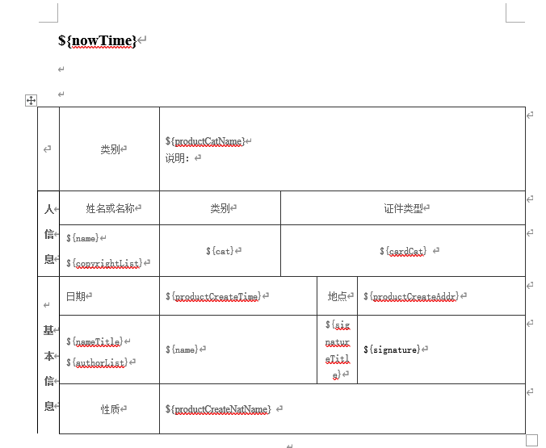
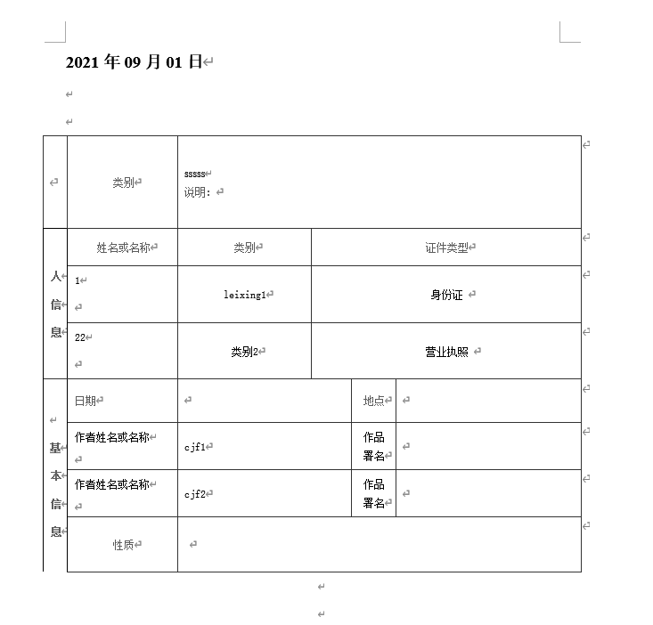

## 使用poi操作word
1. maven依赖
```
<!-- word, ppt, excel 文件的读取 -->
<dependency>
    <groupId>org.apache.poi</groupId>
    <artifactId>poi-ooxml</artifactId>
    <version>5.0.0</version>
</dependency>
<dependency>
    <groupId>org.apache.poi</groupId>
    <artifactId>poi-scratchpad</artifactId>
    <version>5.0.0</version>
</dependency>
```

2. 代码
 ```
 import com.fasterxml.jackson.databind.ObjectMapper;
import org.apache.poi.xwpf.usermodel.*;
import org.openxmlformats.schemas.wordprocessingml.x2006.main.CTRow;

import java.io.*;
import java.util.*;
import java.util.regex.Matcher;
import java.util.regex.Pattern;

/**
 * 相关服务接口
 *

 */
public class WordGenerator {

    /**
     * 修改word到指定的目录
     * @param filename 源文件
     * @param data 模板数据
     * @param dest 目标目录
     * @throws IOException
     */
    public static void modifyWordToDest(File filename, Map<String, Object> data, String dest) throws IOException {
        FileInputStream is = new FileInputStream(filename.getAbsoluteFile());
        modifyWordToDest(is, filename.getName(), data, dest);
    }

    /**
     * 修改word到指定的目录
     * @param is 源文件输入流
     * @param fileName 生成文件名
     * @param data 模板数据
     * @param dest 目标目录
     * @throws IOException
     */
    public static void modifyWordToDest(InputStream is, String fileName, Map<String, Object> data, String dest) throws IOException {
        String tmpFilePath = dest + File.separator + fileName;
        File dir = new File(dest);
        if (!dir.exists()) {
            dir.mkdirs();
        }
        FileOutputStream os = new FileOutputStream(tmpFilePath, false);
        try {
            XWPFDocument document = new XWPFDocument(is);

            // 替换段落里面的占位符
            replaceInPara(document, data);

            // 替换表格里的占位符
            tableSearchAndReplace(document, data);

            // 输出
            document.write(os);
        } catch (Exception e) {
            e.printStackTrace();
        } finally {
            close(is);
            close(os);
        }
    }

    /**
     * poi 查找word表格中占位符并替换
     * 表格占位符格式：${name}
     * @param document
     * @param data
     */
     public static final void tableSearchAndReplace(XWPFDocument document, Map<String, Object> data) {
         // 替换表格中的指定文字
         Iterator<XWPFTable> itTable = document.getTablesIterator();

         while (itTable.hasNext()) {
             XWPFTable table = (XWPFTable) itTable.next();

             // 动态处理表格中的list，动态新增行
             Iterator<Map.Entry<String, Object>> dataIterator = data.entrySet().iterator();
             while (dataIterator.hasNext()) {
                 Map.Entry<String, Object> entry = dataIterator.next();
                 if (entry.getValue() instanceof List) {
                     int rcount = table.getNumberOfRows();
                     for (int i = rcount - 1; i >= 0; i--) {
                         XWPFTableRow row = table.getRow(i);
                         boolean findListPara = false;
                         List<XWPFTableCell> cells = row.getTableCells();
                         for (XWPFTableCell cell : cells) {
                             //表格中处理段落（回车）
                             List<XWPFParagraph> cellParList= cell.getParagraphs();
                             for (XWPFParagraph xwpfParagraph : cellParList) {
                                 findListPara = findListParaInPara(xwpfParagraph, entry.getKey());
                                 if (findListPara) {
                                     break;
                                 }
                             }
                             if (findListPara) {
                                 break;
                             }
                         }
                         if (findListPara) {
                             CTRow sourceRow = (CTRow) table.getRow(i).getCtRow().copy();
                             // 遍历dataMap,valueList
                             List valueList = (List) entry.getValue();
                             for (int j = 0; j < valueList.size(); j++) {
                                 // 设置map值
                                 ObjectMapper mapObject = new ObjectMapper();
                                 Map<String, Object> dataMap = mapObject.convertValue(valueList.get(j), Map.class);

                                if (j==0){
                                    replaceInPara(table.getRow(i+j), dataMap);
                                } else {
                                    // 更改内容必须在 table.addRow 之前完成
                                    XWPFTableRow targetRow = new XWPFTableRow(sourceRow, table);
                                    replaceInPara(targetRow, dataMap);
                                    table.addRow(targetRow, i + j);
                                }
                             }
                         }
                     }
                 }
             }

             // 处理表格中的替代符
             int rcount = table.getNumberOfRows();
             for (int i = 0; i < rcount; i++) {
                 replaceInPara(table.getRow(i), data);
             }
         }
     }

     private static void replaceInPara(XWPFTableRow row, Map<String, Object> data) {
         List<XWPFTableCell> cells = row.getTableCells();
         for (XWPFTableCell cell : cells) {
             //表格中处理段落（回车）
             List<XWPFParagraph> cellParList= cell.getParagraphs();
             for (XWPFParagraph xwpfParagraph : cellParList) {
                 replaceInPara(xwpfParagraph, data);
             }
         }
     }

    /**
     * 替换段落里面的变量 段落占位符格式：${name}
     * @param doc
     * @param params
     */
    private static void replaceInPara(XWPFDocument doc, Map<String, Object> params) {
        Iterator<XWPFParagraph> iterator = doc.getParagraphsIterator();
        XWPFParagraph para;
        while (iterator.hasNext()) {
            para = iterator.next();
            replaceInPara(para, params);
        }
    }

    /**
     * 替换段落里面的变量
     * @param para
     * @param params
     */
    private static void replaceInPara(XWPFParagraph para, Map<String, Object> params) {
        List<XWPFRun> runs;
        Matcher matcher;
        String runText = "";
        int fontSize = 15; // 默认字号
        String fontFamily = "楷体"; // 默认字体
        boolean bold = false; // 默认不加粗

        if (matcher(para.getParagraphText()).find()) {
            runs = para.getRuns();
            if (runs.size() > 0) {
                int j = runs.size();
                for (int i = 0; i < j; i++) {
                    XWPFRun run = runs.get(0);
                    fontSize = run.getFontSize();
                    fontFamily = run.getFontFamily();
                    bold = run.isBold();
                    String i1 = run.toString();
                    runText += i1;
                    // 删除
                    para.removeRun(0);
                }
            }
            matcher = matcher(runText);

            if (matcher.find()) {
                while ((matcher = matcher(runText)).find()) {
                    runText = matcher.replaceFirst(params.get(matcher.group(1)) != null ? String.valueOf(params.get(matcher.group(1))):"");
                }
                // 直接调用XWPFRun的setText()方法设置文本时，在底层会重新创建一个XWPFRun，把文本附加在当前文本后面，
                // 所以我们不能直接设值，需要先删除当前run,然后再自己手动插入一个新的run。
                XWPFRun xwpfRun = para.insertNewRun(0);
                xwpfRun.setBold(bold);
                xwpfRun.setFontSize(fontSize);
                xwpfRun.setFontFamily(fontFamily);
                xwpfRun.setText(runText);
            }
        }
    }
    /**
     * 查询段落里面是list类型的变量
     * @param para
     * @param key
     */
    private static boolean findListParaInPara(XWPFParagraph para, String key) {
        List<XWPFRun> runs;
        String runText = "";
        Matcher matcher;

        if (matcher(para.getParagraphText()).find()) {
            runs = para.getRuns();
            if (runs.size() > 0) {
                int j = runs.size();
                for (int i = 0; i < j; i++) {
                    XWPFRun run = runs.get(i);
                    runText += run.toString();
                }
            }

            matcher = matcher(runText);

            if (matcher.find()) {
                if (matcher.group(1).equals(key)) {
                    return true;
                }
            }
        }
        return false;
    }
    /**
     * 正则匹配字符串
     *
     * @param str
     * @return
     */
    private static Matcher matcher(String str) {
        Pattern pattern = Pattern.compile("\\$\\{(.+?)\\}", Pattern.CASE_INSENSITIVE);
        Matcher matcher = pattern.matcher(str);
        return matcher;
    }

    private static void close(InputStream is) {
        if (is != null) {
            try {
                is.close();
            } catch (IOException e) {
                e.printStackTrace();
            }
        }
    }

    private static void close(OutputStream os) {
        if (os != null) {
            try {
                os.close();
            } catch (IOException e) {
                e.printStackTrace();
            }
        }
    }

    public static void main(String[] args) throws Exception {
        Map<String, Object> valueMap = new HashMap<>();
        valueMap.put("productCatName", "sssss");
        valueMap.put("nowTime", "2021年09月01日");

        List<Map> objects1 = new ArrayList<>();
        Map<String, Object> map1 = new HashMap<>(2);
        map1.put("name", 1l);
        map1.put("cat", "leixing1");
        map1.put("cardCat", "身份证");
        Map<String, Object> map2 = new HashMap<>(2);
        map2.put("name", 22);
        map2.put("cat", "类别2");
        map2.put("cardCat", "营业执照");
        objects1.add(map1);
        objects1.add(map2);
        valueMap.put("copyrightList", objects1);

        List<Map> objects2 = new ArrayList<>();
        Map<String, Object> map3 = new HashMap<>(2);
        map3.put("nameTitle", "作者姓名或名称");
        map3.put("name", "cjf1");
        map3.put("signatureTitle", "作品署名");
        Map<String, Object> map4 = new HashMap<>(2);
        map4.put("nameTitle", "作者姓名或名称");
        map4.put("name", "cjf2");
        map4.put("signatureTitle", "作品署名");
        objects2.add(map3);
        objects2.add(map4);
        valueMap.put("authorList", objects2);

        //        modifyWordToDest(new File("demo/a.docx"),
//                valueMap, "demo/generate");
        FileInputStream is = new FileInputStream(new File("demo/a.docx").getAbsoluteFile());
        modifyWordToDest(is, "b.docx", valueMap, "demo/generate");
    }
}
 ```  
3. 准备模板文件


4. 结果



## 遇到的问题及相应的解决方案

### jar启动项目遇到的问题
1. 获取resource目录
正确方式：
``` 
getClass().getClassLoader().getResourceAsStream("doc/a.docx")
``` 

错误方式：
``` 
getClass().getClassLoader().getResource("doc/a.docx")
``` 
错误方式在jar包启动的项目中会有问题，具体原因可以网上查下原因，不展开

2. 获取jar包所在目录路径
``` 
ApplicationHome h = new ApplicationHome(getClass());
File jarF = h.getSource();
String sysResPath = jarF.getParentFile().toString();
``` 
[参考](https://blog.csdn.net/liangcha007/article/details/88526181)

3. getResourceAsStream碰到中文目录
在本地启动过程时，文件目录采用中文命名（注：不是文件里面的中文内容），例如：new File("目录/测试.docx") ，没有任何问题，可以正常读取到。但部署到服务器上通过jar启动，则提示java.io.FileNotFoundException，暂时还未找到解决办法，如果有人了解，可以联系我，一起讨论下。

### word中表格动态新增行
可以参考代码
